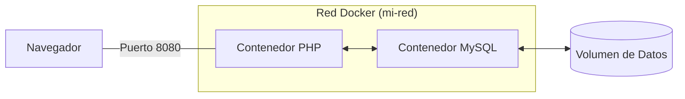

En el tema anterior vimos que los contenedores son geniales, pero tienen un defecto: **no tienen memoria**. Si guardas algo en la base de datos de un contenedor y lo borras, los datos se van con él. Vamos a solucionar esto.

##  Persistencia: Los Volúmenes

En Docker, un **Volumen** es un disco duro externo virtual que conectamos al contenedor. Imagina que el contenedor es una GameBoy: el volumen es el cartucho donde se guardan las partidas. Puedes cambiar de consola (contenedor), pero si pones el cartucho (volumen), tu partida sigue ahí.

### Tipos de persistencia:
1.  **Bind Mounts** (Montajes directos): Lo que usamos en el tema anterior (`-v ${PWD}:/var/www/html`). Sirve para conectar carpetas de tu PC al contenedor. Ideal para el código fuente.
2.  **Named Volumes** (Volúmenes con nombre): Docker gestiona el espacio. Es el método recomendado para bases de datos (MySQL/PostgreSQL) porque es más rápido y seguro.

---

##  Redes: Cómo se comunican los servicios

Por defecto, los contenedores están aislados. Si tienes un contenedor con **PHP** y otro con **MySQL**, no se conocen. Necesitamos meterlos en la misma "sala de chat" o **Red Privada**.



### Ventajas de las redes de Docker:
- **DNS Interno**: Puedes conectar PHP a la base de datos usando el nombre del contenedor (ej: `db`) en lugar de una IP.
- **Seguridad**: La base de datos MySQL puede estar en una red privada sin salida a internet, protegida de ataques externos.

##  Caso Práctico: MySQL con persistencia

Si quisiéramos lanzar una base de datos MySQL que no pierda los datos, usaríamos:

```bash title="Comando MySQL"
docker run -d --name db -e MYSQL_ROOT_PASSWORD=secreto -v mi-data:/var/lib/mysql mysql:8.0
```

- **`-e`**: Variables de entorno (configuración).
- **`-v mi-data:/var/lib/mysql`**: Crea un volumen llamado `mi-data` para guardar las tablas.

:::info ¿Dónde están mis archivos?
Los **Named Volumes** no son carpetas fáciles de ver en tu Windows. Docker los guarda en una zona protegida de WSL 2 para asegurar que el rendimiento sea máximo.
:::
