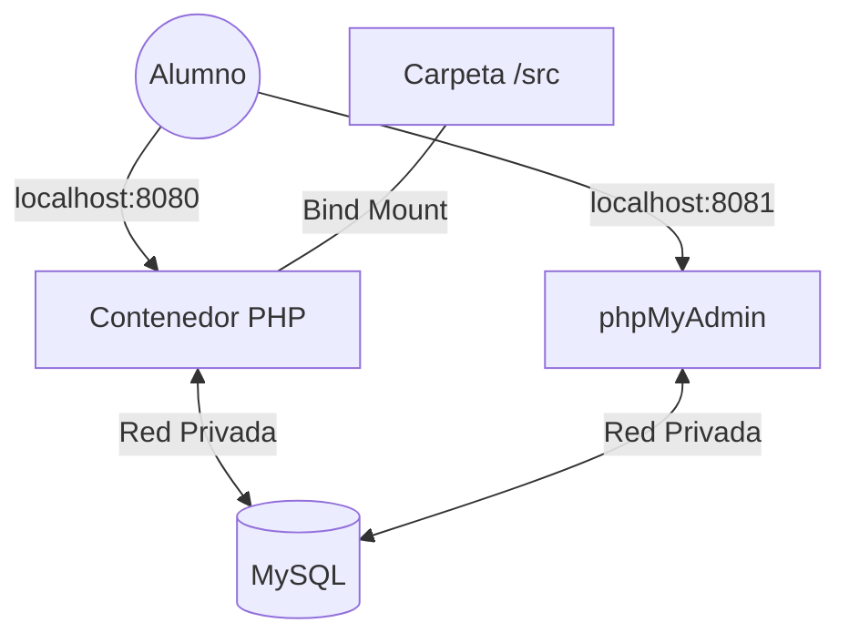

Lanzar comandos `docker run` larguísimos es propenso a errores. Para aplicaciones reales que necesitan varios servicios (PHP + MySQL + phpMyAdmin), usamos **Docker Compose**.

Con un solo archivo YAML, definimos toda nuestra infraestructura.

## 📝 El archivo `docker-compose.yml`

Imagina que este archivo es el "Menú" de un restaurante. Tú eliges qué platos quieres y Docker los cocina todos a la vez.

```yaml title="docker-compose.yml"
services:
  # Servidor Web con PHP
  web:
    image: php:8.2-apache
    ports:
      - "8080:80"
    volumes:
      - ./src:/var/www/html
    networks:
      - mi-red

  # Base de Datos MySQL
  db:
    image: mysql:8.0
    environment:
      MYSQL_ROOT_PASSWORD: root
      MYSQL_DATABASE: mi_proyecto
    volumes:
      - db-data:/var/lib/mysql
    networks:
      - mi-red

  # Interfaz gráfica para la DB
  phpmyadmin:
    image: phpmyadmin/phpmyadmin
    ports:
      - "8081:80"
    environment:
      PMA_HOST: db
    networks:
      - mi-red

networks:
  mi-red:

volumes:
  db-data:
```

---

## 🏗️ Arquitectura del Entorno



## 🚀 Cómo ponerlo en marcha

1.  Crea una carpeta para tu proyecto.
2.  Crea el archivo `docker-compose.yml` con el código de arriba.
3.  Crea una carpeta `src/` y dentro un `index.php`.
4.  En la terminal, ejecuta:
    ```bash title="Lanzar todo"
    docker-compose up -d
    ```

**¡Boom!** Tienes tres servidores corriendo, conectados entre sí y con persistencia de datos.

## 🛑 Comandos de Gestión de Compose

- **Ver estado**: `docker-compose ps`
- **Ver logs (errores de PHP)**: `docker-compose logs -f web`
- **Detener y borrar todo**: `docker-compose down` (Este comando limpia todo excepto los volúmenes, dejando tu PC impecable).

:::important Conclusión de la Unidad
Has pasado de usar una herramienta "caja negra" como XAMPP a ser un **arquitecto de sistemas**. Ahora tienes el control total de las versiones, la red y la seguridad de tus aplicaciones. ¡Bienvenido al mundo profesional!
:::
